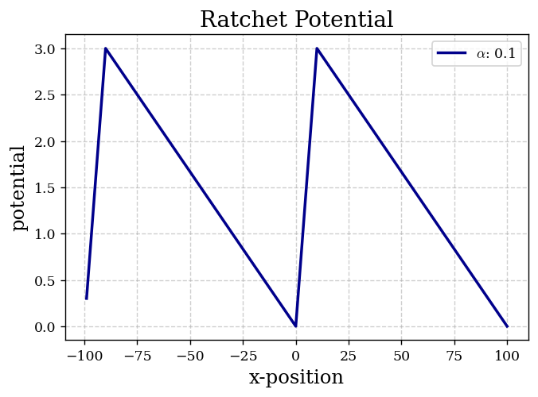
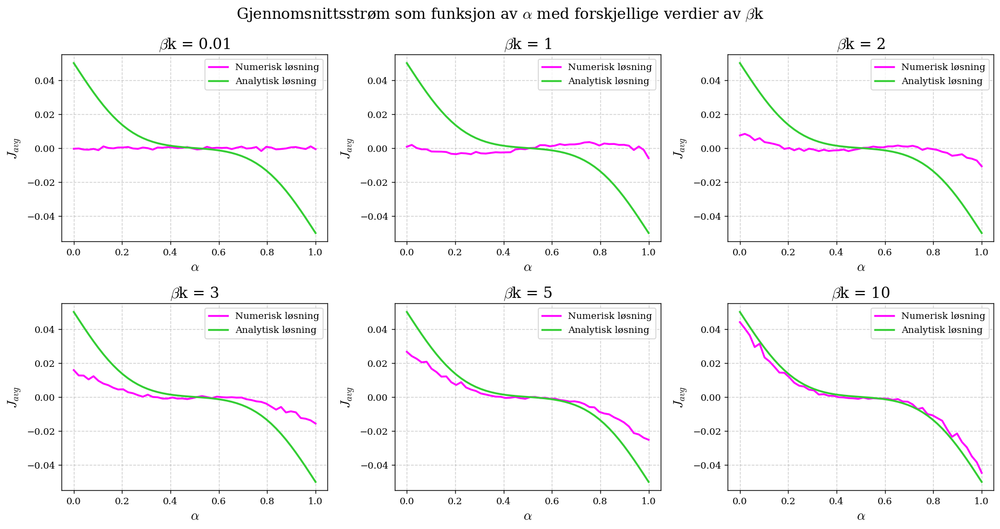

## HTML Version
You can view the HTML version of this notebook [here](https://endregb.github.io/motor-protein-modelling/).

# Motor Protein Transport Simulation

This project models the stochastic motion of motor proteins, such as myosin, as they move along structures in the cell, like myofilaments. These proteins convert chemical energy from ATP into mechanical work, allowing them to "walk" along intracellular tracks and transport cellular cargo.

The notebook simulates this process using a **biased random walk** in a **two-level periodic potential landscape**, capturing essential features of directional movement, asymmetry, and stochasticity in biological systems.


*Figure 1: Illustration of the two-level periodic potential landscape used to model motor protein movement. The asymmetry in potential wells creates directional bias, while thermal fluctuations allow proteins to overcome energy barriers and "walk" along the track.*


*Figure 2: Simulation results showing the average current (net directional movement) of motor proteins over time as a function of the assymetry of the ratchet potential ($\alpha$). The positive current indicates biased movement in one direction, demonstrating how asymmetric transition probabilities lead to directional transport even in the presence of thermal noise.*

---

## Objectives

- Understand how **microscopic transition probabilities** give rise to **macroscopic transport behavior**
- Use numerical methods to simulate transport and compare with analytical predictions
- Explore how parameters like **thermal energy**, and **asymmetry** affect net motion

---

## Methods

- **Random walk simulations** (Monte Carlo-style) on a 1D discrete lattice
- Modelling transport in a **two-level potential** with probabilistic stepping

---

## Structure

- The simulation and analysis are implemented in a single notebook:
  - `motorprotein_simulation.ipynb`
- Each section corresponds to a specific task (e.g., 2a, 2b...) as defined in the original assignment
- All plots are labelled and explained inline

---

## Academic Context

This project was completed as a group assignment as part of the university course **TMA4320 Introduksjon til vitenskapelige beregninger**at NTNU (Spring 2025).
Therefore the notebook and all comments are written in **Norwegian**.
However, this `README.md` provides an overview in English for external readers.
The exercise is based on Haakon Krogstad’s 2020 project *"Modelling motor proteins as particles diffusing in parallel potentials"*. 
The work was carried out in collaboration with:

- [eirikrba](https://github.com/eirikrba)
- [adrianlund2003](https://github.com/adrianlund2003)
- [andrea14](https://github.com/andrea14)

The submitted notebook represents our collective work.

---

## Conclusion

Through random walk simulations in a two-level periodic potential, we were able to model the directional transport of motor proteins under stochastic dynamics. The results illustrate how asymmetry in stepping probabilities leads to a net current, even in the absence of a macroscopic force.

The simulations qualitatively match theoretical expectations, showing:

- Zero net transport in symmetric potentials  
- Directional movement when asymmetry is introduced  
- Agreement with analytical predictions under appropriate parameter choices

This supports the idea that directional motion in motor proteins can emerge purely from stochastic stepping and energy asymmetries, and highlights how relatively simple models can capture key aspects of complex biological processes.


## Requirements

- Python 3.x
- `numpy`
- `matplotlib`
- `scipy`
- `pandas`
- `warnings` (to suppress warnings in the notebook)
- `jupyter` (for running the notebook)
- `tqdm` (optional)

Install with:

```bash
pip install -r requirements.txt

